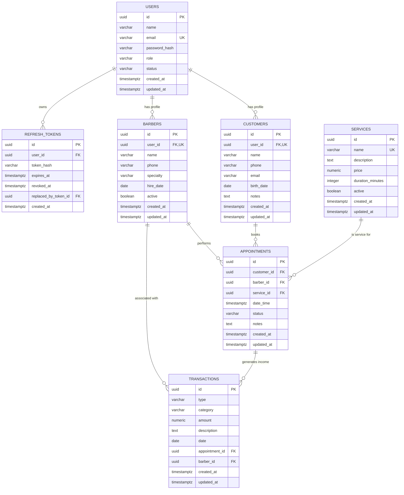

# Database Documentation

## Overview

BarberLab uses **PostgreSQL 16** as its primary database. The schema is managed
through versioned migrations using **node-pg-migrate**, ensuring both SECURE and
VULNERABLE variants share the same database structure.

## Entity Relationship Diagram



## Tables

### users

Stores authentication credentials and role information.

| Column        | Type         | Constraints                                          |
| ------------- | ------------ | ---------------------------------------------------- |
| id            | uuid         | PK, DEFAULT gen_random_uuid()                        |
| name          | varchar(255) | NOT NULL                                             |
| email         | varchar(255) | NOT NULL, UNIQUE                                     |
| password_hash | varchar(255) | NOT NULL                                             |
| role          | varchar(20)  | NOT NULL, CHECK (CUSTOMER, BARBER, ADMIN)            |
| status        | varchar(20)  | NOT NULL, DEFAULT 'ACTIVE', CHECK (ACTIVE, INACTIVE) |
| created_at    | timestamptz  | NOT NULL, DEFAULT now()                              |
| updated_at    | timestamptz  | NOT NULL, DEFAULT now()                              |

**Indexes:** `users_email_idx` (UNIQUE)

### customers

Stores customer profiles. Can exist with or without a user account.

| Column     | Type         | Constraints                                     |
| ---------- | ------------ | ----------------------------------------------- |
| id         | uuid         | PK, DEFAULT gen_random_uuid()                   |
| user_id    | uuid         | NULL, UNIQUE, FK → users(id) ON DELETE SET NULL |
| name       | varchar(255) | NOT NULL                                        |
| phone      | varchar(50)  | NOT NULL                                        |
| email      | varchar(255) | NULL                                            |
| birth_date | date         | NULL                                            |
| notes      | text         | NULL                                            |
| created_at | timestamptz  | NOT NULL, DEFAULT now()                         |
| updated_at | timestamptz  | NOT NULL, DEFAULT now()                         |

**Indexes:** `customers_phone_idx`, `customers_user_id_idx`

### barbers

Stores barber professional profiles.

| Column     | Type         | Constraints                                     |
| ---------- | ------------ | ----------------------------------------------- |
| id         | uuid         | PK, DEFAULT gen_random_uuid()                   |
| user_id    | uuid         | NULL, UNIQUE, FK → users(id) ON DELETE SET NULL |
| name       | varchar(255) | NOT NULL                                        |
| phone      | varchar(50)  | NULL                                            |
| specialty  | varchar(255) | NULL                                            |
| hire_date  | date         | NOT NULL, DEFAULT now()                         |
| active     | boolean      | NOT NULL, DEFAULT true                          |
| created_at | timestamptz  | NOT NULL, DEFAULT now()                         |
| updated_at | timestamptz  | NOT NULL, DEFAULT now()                         |

**Indexes:** `barbers_user_id_idx`

### services

Catalog of services offered.

| Column           | Type          | Constraints                            |
| ---------------- | ------------- | -------------------------------------- |
| id               | uuid          | PK, DEFAULT gen_random_uuid()          |
| name             | varchar(255)  | NOT NULL, UNIQUE                       |
| description      | text          | NULL                                   |
| price            | numeric(10,2) | NOT NULL, CHECK (price > 0)            |
| duration_minutes | integer       | NOT NULL, CHECK (duration_minutes > 0) |
| active           | boolean       | NOT NULL, DEFAULT true                 |
| created_at       | timestamptz   | NOT NULL, DEFAULT now()                |
| updated_at       | timestamptz   | NOT NULL, DEFAULT now()                |

### appointments

Core scheduling entity linking customers, barbers, and services.

| Column      | Type        | Constraints                                                                   |
| ----------- | ----------- | ----------------------------------------------------------------------------- |
| id          | uuid        | PK, DEFAULT gen_random_uuid()                                                 |
| customer_id | uuid        | NOT NULL, FK → customers(id) ON DELETE RESTRICT                               |
| barber_id   | uuid        | NOT NULL, FK → barbers(id) ON DELETE RESTRICT                                 |
| service_id  | uuid        | NOT NULL, FK → services(id) ON DELETE RESTRICT                                |
| date_time   | timestamptz | NOT NULL                                                                      |
| status      | varchar(20) | NOT NULL, DEFAULT 'PENDING', CHECK (PENDING, CONFIRMED, COMPLETED, CANCELLED) |
| notes       | text        | NULL                                                                          |
| created_at  | timestamptz | NOT NULL, DEFAULT now()                                                       |
| updated_at  | timestamptz | NOT NULL, DEFAULT now()                                                       |

**Indexes:**

- `appointments_barber_datetime_idx` (barber_id, date_time)
- `appointments_customer_datetime_idx` (customer_id, date_time)
- `appointments_status_idx` (status)

### transactions

Financial records for income and expenses.

| Column         | Type          | Constraints                                    |
| -------------- | ------------- | ---------------------------------------------- |
| id             | uuid          | PK, DEFAULT gen_random_uuid()                  |
| type           | varchar(10)   | NOT NULL, CHECK (INCOME, EXPENSE)              |
| category       | varchar(100)  | NOT NULL                                       |
| amount         | numeric(10,2) | NOT NULL, CHECK (amount > 0)                   |
| description    | text          | NULL                                           |
| date           | date          | NOT NULL                                       |
| appointment_id | uuid          | NULL, FK → appointments(id) ON DELETE SET NULL |
| barber_id      | uuid          | NULL, FK → barbers(id) ON DELETE SET NULL      |
| created_at     | timestamptz   | NOT NULL, DEFAULT now()                        |
| updated_at     | timestamptz   | NOT NULL, DEFAULT now()                        |

**Indexes:**

- `transactions_date_idx` (date)
- `transactions_type_idx` (type)
- `transactions_appointment_id_idx` (appointment_id)
- `transactions_barber_id_idx` (barber_id)

### refresh_tokens

Stores hashed refresh tokens for JWT authentication with rotation support.

| Column               | Type         | Constraints                                      |
| -------------------- | ------------ | ------------------------------------------------ |
| id                   | uuid         | PK, DEFAULT gen_random_uuid()                    |
| user_id              | uuid         | NOT NULL, FK → users(id) ON DELETE CASCADE       |
| token_hash           | varchar(255) | NOT NULL                                         |
| expires_at           | timestamptz  | NOT NULL                                         |
| revoked_at           | timestamptz  | NULL                                             |
| replaced_by_token_id | uuid         | NULL, FK → refresh_tokens(id) ON DELETE SET NULL |
| created_at           | timestamptz  | NOT NULL, DEFAULT now()                          |

**Indexes:** `refresh_tokens_user_id_idx`, `refresh_tokens_expires_at_idx`

## Foreign Key Behaviors

| FK                                                   | On Delete | Rationale                                       |
| ---------------------------------------------------- | --------- | ----------------------------------------------- |
| customers.user_id → users                            | SET NULL  | Customer profile preserved if user deleted      |
| barbers.user_id → users                              | SET NULL  | Barber profile preserved if user deleted        |
| appointments.customer_id → customers                 | RESTRICT  | Prevent deletion of customers with appointments |
| appointments.barber_id → barbers                     | RESTRICT  | Prevent deletion of barbers with appointments   |
| appointments.service_id → services                   | RESTRICT  | Prevent deletion of services with appointments  |
| transactions.appointment_id → appointments           | SET NULL  | Keep transaction record, unlink appointment     |
| transactions.barber_id → barbers                     | SET NULL  | Keep transaction record, unlink barber          |
| refresh_tokens.user_id → users                       | CASCADE   | Tokens invalidated when user deleted            |
| refresh_tokens.replaced_by_token_id → refresh_tokens | SET NULL  | Maintain rotation chain integrity               |

## Constraints Summary

### Check Constraints

- `users_role_check`: role IN ('CUSTOMER', 'BARBER', 'ADMIN')
- `users_status_check`: status IN ('ACTIVE', 'INACTIVE')
- `services_price_check`: price > 0
- `services_duration_check`: duration_minutes > 0
- `appointments_status_check`: status IN ('PENDING', 'CONFIRMED', 'COMPLETED',
  'CANCELLED')
- `transactions_type_check`: type IN ('INCOME', 'EXPENSE')
- `transactions_amount_check`: amount > 0

### Unique Constraints

- `users_email_key`: email
- `customers_user_id_key`: user_id
- `barbers_user_id_key`: user_id
- `services_name_key`: name

## Indexes

| Table          | Index                              | Columns                  | Type   |
| -------------- | ---------------------------------- | ------------------------ | ------ |
| users          | users_email_idx                    | email                    | UNIQUE |
| customers      | customers_phone_idx                | phone                    | BTREE  |
| customers      | customers_user_id_idx              | user_id                  | BTREE  |
| barbers        | barbers_user_id_idx                | user_id                  | BTREE  |
| appointments   | appointments_barber_datetime_idx   | (barber_id, date_time)   | BTREE  |
| appointments   | appointments_customer_datetime_idx | (customer_id, date_time) | BTREE  |
| appointments   | appointments_status_idx            | status                   | BTREE  |
| transactions   | transactions_date_idx              | date                     | BTREE  |
| transactions   | transactions_type_idx              | type                     | BTREE  |
| transactions   | transactions_appointment_id_idx    | appointment_id           | BTREE  |
| transactions   | transactions_barber_id_idx         | barber_id                | BTREE  |
| refresh_tokens | refresh_tokens_user_id_idx         | user_id                  | BTREE  |
| refresh_tokens | refresh_tokens_expires_at_idx      | expires_at               | BTREE  |

## Migrations

Located in `packages/core/src/infrastructure/database/migrations/`:

| Order | Migration                        | Description                       |
| ----- | -------------------------------- | --------------------------------- |
| 1     | `create-users-table.js`          | Users table with roles and status |
| 2     | `create-customers-table.js`      | Customers with optional user link |
| 3     | `create-barbers-table.js`        | Barbers with optional user link   |
| 4     | `create-services-table.js`       | Services catalog                  |
| 5     | `create-appointments-table.js`   | Appointments with FKs             |
| 6     | `create-transactions-table.js`   | Financial transactions            |
| 7     | `create-refresh-tokens-table.js` | JWT refresh tokens                |

### Running Migrations

```bash
# Apply all pending migrations
npm run db:migrate

# Rollback last migration
npm run db:rollback

# Rollback N migrations
npm run db:rollback -- 3

# Check migration status (dry-run lists pending migrations)
npm run db:status
```

### Migration Commands

- `npm run db:migrate` — Apply pending migrations
- `npm run db:rollback` — Rollback last migration
- `npm run db:rollback -- <n>` — Rollback n migrations
- `npm run db:status` — List pending migrations (dry-run)
- `npm run db:create -- -- <name>` — Scaffold a new migration file

Migrations are written in CommonJS JavaScript (`.js` with
`exports.up`/`exports.down`) and are loaded directly by node-pg-migrate.
Configuration lives in
`packages/core/src/infrastructure/database/migrate-config.json` (JSON, required
by node-pg-migrate v8+).

## Seed Data

Located at `packages/core/src/infrastructure/database/seeds/seed.ts`.

Creates deterministic development data:

| Entity       | Count | Details                                        |
| ------------ | ----- | ---------------------------------------------- |
| Admin        | 1     | admin@barberlab.local                          |
| Barbers      | 2     | With user accounts                             |
| Customers    | 4     | 3 with accounts, 1 walk-in                     |
| Services     | 5     | Corte, Barba, Combo, Corte Feminino, Coloração |
| Appointments | 6     | 3 future, 2 completed, 1 cancelled             |
| Transactions | 7     | 4 income, 3 expense                            |

### Running Seed

```bash
npm run db:seed
```

**Development Credentials (password for all: `dev123456`):**

- Admin: admin@barberlab.local
- Barbers: joao.barbeiro@barberlab.local, maria.barbeira@barberlab.local
- Customers: carlos.cliente@barberlab.local, ana.cliente@barberlab.local,
  pedro.cliente@barberlab.local

> ⚠️ **NEVER USE THESE CREDENTIALS IN PRODUCTION**

## Database Connection

Connection is managed via
`packages/core/src/infrastructure/database/connection.ts`:

- Uses `pg` Pool with configurable pool size
- Configuration via environment variables
- Centralized `query`, `queryOne`, `execute`, `transaction` helpers
- Health check endpoint: `healthCheck()`

### Environment Variables

| Variable              | Default   | Description             |
| --------------------- | --------- | ----------------------- |
| DB_HOST               | localhost | PostgreSQL host         |
| DB_PORT               | 5432      | PostgreSQL port         |
| DB_NAME               | barberlab | Database name           |
| DB_USER               | barberlab | Database user           |
| DB_PASSWORD           | changeme  | Database password       |
| DB_POOL_MAX           | 20        | Max pool connections    |
| DB_IDLE_TIMEOUT       | 30000     | Idle timeout (ms)       |
| DB_CONNECTION_TIMEOUT | 5000      | Connection timeout (ms) |

### Test Database

Uses separate database `barberlab_test` with environment prefix `TEST_*_DB_*`.

## UUID Strategy

All primary keys use `uuid` with `gen_random_uuid()` (requires `pgcrypto`
extension, enabled by default in PostgreSQL 16).

Generated by database, not application, to ensure consistency across distributed
systems.

## Security Considerations

- **No secrets in repository**: All credentials via environment variables
- **Password hashing**: Argon2id via `argon2` package (seed only; runtime auth
  not yet implemented)
- **Refresh tokens**: Stored as hash, never plaintext
- **Connection pooling**: Prevents connection exhaustion
- **PostgreSQL not exposed**: Docker internal network only
- **Least privilege**: Application user has only necessary permissions

## Testing

Integration tests in
`packages/core/src/infrastructure/database/tests/integration.test.ts`:

1. Migrations apply from zero
2. Migrations rollback/reapply correctly
3. All tables exist with correct columns
4. Foreign keys enforce referential integrity
5. Unique constraints prevent duplicates
6. Check constraints reject invalid values
7. Indexes exist for query performance
8. Seed creates expected data
9. Seed passwords use Argon2id
10. Transaction isolation works

### Running Tests

```bash
# Start test database
docker compose -f docker-compose.test.yml up -d

# Run database tests
npm run db:test

# Or run all tests including database
npm run test
```

## Relationship to the Domain

The schema in this document is the persistence view of the domain model. The
domain entities, value objects, business rules, and application use cases are
documented in [`docs/domain.md`](domain.md). The domain layer does not execute
SQL; it works against repository interfaces, which are backed by this schema via
the infrastructure layer.
